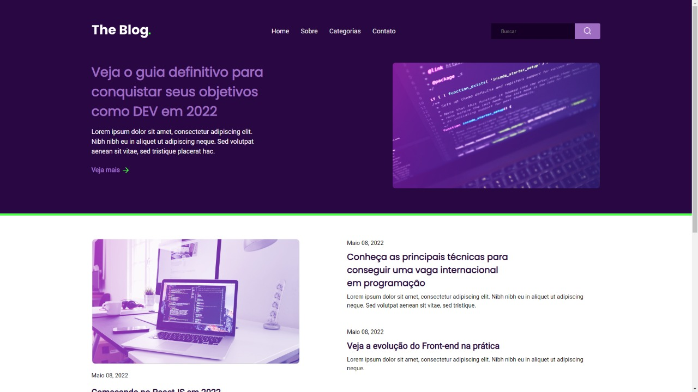

<h1 align="center">
  RocketBlog
</h1>

  

  

 

  

## 🚀 Tecnologias

Esse projeto foi desenvolvido com as seguintes tecnologias:

- HTML
- CSS

## 🚧 Projeto

Live Preview: https://lucasmedeiros7.github.io/rocketblog/

## 🎨 Inspiração:

Figma: https://www.figma.com/file/r4CsL6MPTAvE7EvJXjhFK4/DD-RocketBlog

---

Feito com ♥ by Lucas Medeiros